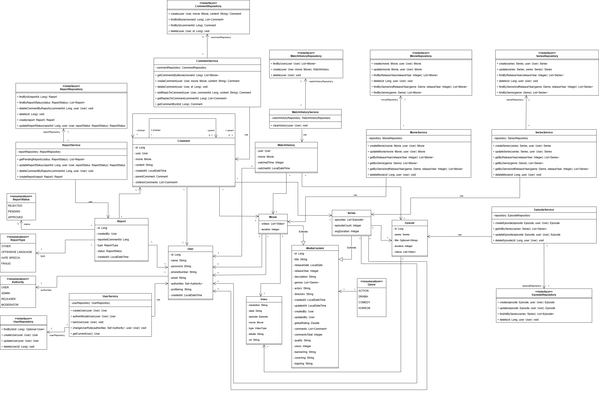

# Názov témy
Streamingová platforma

## Stručný popis témy
Táto služba poskytuje používateľom možnosť vyhľadávať filmy a televízne seriály podľa rôznych parametrov, prezerať ich v rôznej kvalite v závislosti od predplatného a zanechávať komentáre. Zavedený je systém rolí: administrátori môžu pridávať a spravovať obsah a používatelia môžu s platformou komunikovať. K dispozícii je registrácia, autorizácia, vyhľadávanie, história prehliadania a pohodlný systém kategórií. Platforma podporuje rôzne formáty videí, čím zabezpečuje pohodlné sledovanie pre každého používateľa.

## Zoznam požiadaviek
- **RQ01**  Systém umožní registráciu používateľa. (The system allows user registration.)
- **RQ02**  Systém umožní autentifikáciu používateľa. (The system allows user authentication.)
- **RQ03**  Systém umožní prehrávanie filmu. (The system allows watching a film.)
- **RQ04**  Systém umožní úpravu používateľského profilu. (The system allows editing the user profile.)
- **RQ05**  Systém umožní pridanie komentára k filmu. (The system allows commenting on a film.)
- **RQ06**  Systém umožní zobrazenie histórie sledovania. (The system allows viewing watch history.)
- **RQ07**  Systém umožní správu používateľov. (The system allows managing users.)
- **RQ08**  Systém umožní nahranie filmu. (The system allows uploading a film.)
- **RQ09**  Systém umožní úpravu informácií o filme. (The system allows editing film information.)
- **RQ10**  Systém umožní vymazanie komentárov. (The system allows deleting comments.)
- **RQ11**  Systém umožní zablokovanie používateľov. (The system allows banning users.)
- **RQ12**  Systém umožní nahlásenie komentára. (The system allows reporting a comment.)

Pre lepšie pochopenie prípadov použitia si môžete pozrieť súbor [Use-cases.pdf](./Use-cases.pdf). (Verzia v angličtine.)

## Slovník pojmov
| **Pojem**              | **Anglický názov** | **Definícia**                                                                                                         |
|------------------------|--------------------|-----------------------------------------------------------------------------------------------------------------------|
| **Používateľ**         | **User**           | Registrovaný a prihlásený používateľ, ktorý môže sledovať filmy a pridávať komentáre.                                 |
| **Releaser**           | **Releaser**       | Používateľ s oprávneniami na nahrávanie a publikovanie nového audiovizuálneho obsahu (filmov a seriálov).             |
| **Moderátor**          | **Moderator**      | Používateľ s oprávneniami na správu komentárov. Môže mazať komentáre, blokovať a odblokovať používateľov.             |
| **Administrátor**      | **Admin**          | Používateľ s oprávneniami na správu obsahu platformy. Môže pridávať a upravovať filmy.                                |
| **Authorita**          | **Authority**      | Definuje úroveň prístupu používateľa (`USER`, `MODERATOR`, `ADMIN`, `RELEASER`).                                      |
| **Žáner**              | **Genre**          | Kategória filmu, napríklad `ACTION`, `DRAMA`, `COMEDY`, `THRILLER`, `DOCUMENTARY`, `HORROR`.                          |
| **Komentár**           | **Comment**        | Textová recenzia, ktorú používateľ zanechal pod filmom.                                                               |
| **Hlásenie**           | **Report**         | Sťažnosť na komentár, ktorá obsahuje dôvod a stav preskúmania.                                                        |
| **ReportStatus**       | **ReportStatus**   | Stav hlásenia, ktorý určuje aktuálny stav spracovania hlásenia. Môže byť PENDING, REJECTED, alebo APPROVED.           |
| **ReportType**         | **ReportType**     | Typ hlásenia, ktorý určuje dôvod podania sťažnosti na komentár. Môže byť OFFENSIVE LANGUAGE, HATE SPEECH, alebo SPAM. |
| **HistóriaSledovania** | **WatchHistory**   | Záznam o filmoch, ktoré používateľ sledoval. Obsahuje informácie o filme, dátume a čase sledovania.                   |
| **Film**               | **Movie**          | Samostatné audiovizuálne dielo určené na sledovanie.                                                                  |                                                              |
| **Seriál**             | **Series**         | Séria epizód audiovizuálneho obsahu zvyčajne rozdelená do sezón.                                                      |
| **Video**              | **Video**          | Všeobecný pojem pre audiovizuálny obsah, ktorý zahŕňa filmy aj seriály.                                               |

## Doménový Model - Diagram Tried

Diagram zobrazuje triedy, ich atribúty, metódy a vzťahy medzi nimi. Takto poskytuje jasnú predstavu o tom, ako sú rôzne časti systému vzájomne prepojené a ako spolu interagujú.

## Použité technológie:

#### **Backend**
- **Java 21**  
  The application is built with the latest version of Java to leverage the newest language features and improvements.
- **Spring Boot** (spring-web, spring-data-jpa, spring-security)  
  Spring Boot is used to simplify configuration and development, with modules for RESTful APIs, database access, and security.
- **Hibernate** (JPA)  
  Is used for Object-Relational Mapping (ORM) to handle database interactions and transactions.
- **PostgreSQL**  
  A powerful relational database used to store the application's data.
- **Redis**  
  Used for caching frequently accessed data to improve performance.

#### **Object Mapping**
- **MapStruct** (for DTO ↔ Entity mapping)  
  MapStruct is used for automatic mapping between DTOs and entities, reducing boilerplate code and improving maintainability.

#### **API Documentation**
- **OpenAPI** (Swagger)  
  OpenAPI is used to document and define the RESTful APIs, making it easier to understand available endpoints and their parameters.

#### **Authentication & Authorization**
- **Keycloak** (OAuth2 / OpenID Connect for user authentication)  
  Keycloak is integrated to handle authentication and authorization. It provides Single Sign-On (SSO), role-based access control, and supports OAuth2 and OpenID Connect protocols.

#### **Frontend**
- **Angular 19.2.7**  
  The frontend is built with Angular, a powerful framework for building dynamic web applications.
- **TypeScript**  
  Is used to provide static typing, making the code more robust and maintainable.
- **RxJS**  
  Is used for reactive programming, handling asynchronous data streams and event-based programming.
- **SCSS**  
  Is used for writing modular and maintainable CSS with additional features like variables, nested rules, and mixins.
- **Bootstrap**  
  Is used for responsive design, with pre-built components and layout utilities.

#### **DevOps / Infrastructure**
- **Docker**  
  Is used to containerize the application, ensuring consistent deployment across all environments.
- **AWS**  
  The application is deployed on Amazon Web Services (AWS), utilizing various services like EC2, S3, and possibly others for scaling and infrastructure management.

## Hexagonálna Architektúra

Projekt je navrhnutý podľa princípov hexagonálnej architektúry a pozostáva z viacerých modulov, ktoré spolu vytvárajú ucelenú štruktúru aplikácie:

1. **domain**
    - Predstavuje jadro celej architektúry – obsahuje základnú doménovú logiku aplikácie.
    - Nachádzajú sa tu modely, pravidlá a logické operácie, ktoré sú úplne nezávislé od akýchkoľvek technických detailov alebo externých systémov.
    - Tento modul je srdcom aplikácie a ostatné časti systému sú navrhnuté tak, aby sa naň napájali bez toho, aby narúšali jeho nezávislosť.

2. **outbound-repository-jpa**
    - Zabezpečuje komunikáciu s databázou pomocou technológie JPA.
    - Obsahuje implementácie úložísk, ktoré premosťujú doménové objekty s databázovými tabuľkami.
    - Vďaka tomuto oddeleniu ostáva doména nezávislá od spôsobu ukladania dát.

3. **inbound-controller-ws**
    - Tento modul slúži ako vstupná brána pre vonkajšie požiadavky – typicky cez webové služby.
    - Zahŕňa controllery, ktoré prijímajú vstupy (napr. z webových rozhraní alebo API volaní) a zabezpečujú ich spracovanie.
    - Transformuje prijaté dáta do formy, ktorú dokáže spracovať doménová vrstva.

4. **springboot**
    - Hlavný štartovací modul, ktorý integruje a spúšťa celú aplikáciu.
    - Využíva framework Spring Boot, ktorý výrazne zjednodušuje konfiguráciu a nasadenie.
    - Tento modul spája všetky ostatné časti a zabezpečuje ich bezproblémovú spoluprácu.

5. **api-spec**
    - Obsahuje špecifikáciu rozhraní vo formáte OpenAPI.
    - Vďaka tejto vrstve je presne definované, ako majú externé systémy alebo používateľské rozhrania komunikovať s aplikáciou.
    - Zabezpečuje konzistenciu a predvídateľnosť v komunikácii medzi systémom a jeho klientmi.

## Konfigurácia

1. Nastavenia aplikácie sa riadia pomocou konfiguračného súboru `application.yml`. V tomto súbore môžete upravovať rôzne parametre podľa potrieb projektu – napríklad:

    - **Databázové pripojenie** – definovanie URL adresy, používateľského mena, hesla či typu databázy.
    - **Nastavenia servera** – port, na ktorom aplikácia beží, alebo kontextová cesta.
    - **Konfigurácie pre logovanie, bezpečnosť, cache a ďalšie komponenty** – všetko sa dá prispôsobiť práve cez tento súbor.

## Dokumentácia API

API dokumentácia je dostupná cez OpenAPI na adrese `/swagger-ui.html` po spustení aplikácie.

## Architektúra

Tento projekt je postavený na princípoch **hexagonálnej architektúry (Hexagonal Architecture)**, ktorá zabezpečuje dôsledné oddelenie doménovej logiky od technických detailov aplikácie. Cieľom tohto prístupu je vytvoriť modulárny, ľahko testovateľný a udržiavateľný systém.

V strede celej architektúry sa nachádza **doména** – tá obsahuje hlavnú logiku aplikácie a funguje nezávisle od vstupov (napr. API) aj výstupov (napr. databáza).

### Porty a adaptéry

Hexagonálna architektúra pracuje s dvoma základnými pojmami: **porty** a **adaptéry**.

- **Port (rozhranie)** – V doménovej vrstve sa definujú rozhrania, ktoré predstavujú tzv. porty. Tie určujú, ako môže doména komunikovať s okolitým svetom alebo čo od neho očakáva. Ide o abstraktné definície operácií, ktoré buď poskytujeme (inbound), alebo požadujeme (outbound).

- **Adaptér (implementácia)** – Implementácie portov sa nachádzajú v technickej vrstve. Adaptéry slúžia ako mosty medzi doménou a externými systémami (napr. webové služby, databázy). Prekladajú volania z jedného sveta do druhého.

#### Typy adaptérov:

- **Inbound adaptér**  
  Zabezpečuje vstupné operácie do aplikácie (napr. REST API). Externí používatelia alebo systémy cez tento typ adaptéra komunikujú s doménou. Implementuje tzv. primárne porty – definované samotnou doménou.

- **Outbound adaptér**  
  Starajú sa o komunikáciu smerom von z aplikácie (napr. volanie databázy, externých API). V tomto prípade doména definuje, čo od sveta potrebuje, a technická vrstva to zabezpečuje. Ide o implementácie sekundárnych portov.

## Odporúčané Triedy na Preskúmanie

## Zabezpečenie

## Implementované Užívateľské Prípady (UC)

## Inštalácia a Spustenie